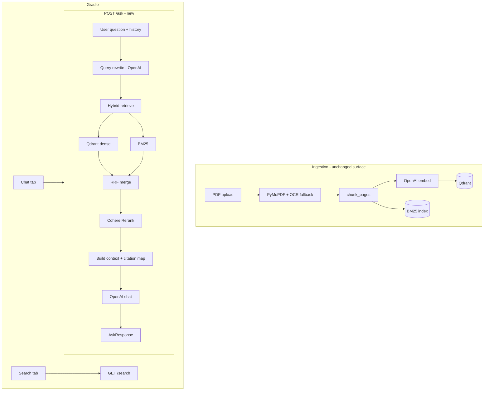

# Phase 2: Grounded RAG — Generation, Hybrid Search, Reranking, OCR, Evaluation

## Summary

Extend the Research RAG pipeline from **retrieval-only inspection** (Phase 1) to a **grounded Q&A assistant**: users ask questions, receive answers with traceable citations, and benefit from stronger retrieval (BM25 + dense fusion, Cohere rerank) before generation. Add OCR for scanned PDFs and a minimal evaluation harness to measure retrieval and answer quality over time.

Phase 1 proved ingestion and dense search. Phase 2 delivers the product surface users expect while preserving the discipline of inspecting retrieval before trusting generation.

---

## Problem Frame

Today the Gradio **Search** tab shows ranked **raw chunks** from Qdrant — not LLM answers. That is intentional: retrieval quality gates everything downstream. Users cannot yet:

- Get a synthesized, grounded answer to a research question
- See inline citations (`[1]`, `[2]`) tied to `page_number` and `chunk_id`
- Chat across turns with follow-up questions
- Retrieve keyword-heavy spans (names, clause numbers) that dense-only search misses
- Re-rank noisy top-K results before the LLM sees context
- Ingest scanned PDFs where PyMuPDF returns empty text
- Regression-test whether changes improved answers

Phase 2 closes these gaps incrementally (2A → 2G), each with a test gate, without replacing Gradio or rewriting Phase 1 ingestion.

---

## Requirements

| ID | Requirement |
|----|-------------|
| R1 | `POST /ask` accepts a question (+ optional chat history) and returns an answer grounded only in retrieved context |
| R2 | Every factual claim in the answer maps to at least one structured `Citation` (`document_id`, `filename`, `page_number`, `chunk_id`, quote snippet) |
| R3 | When context is insufficient, the system explicitly states it cannot answer — no hallucinated facts |
| R4 | Retrieval for `/ask` uses dense search (existing) as baseline; hybrid BM25 + dense fusion improves keyword-heavy queries |
| R5 | A Cohere Rerank step re-orders candidates before LLM context assembly |
| R6 | Multi-turn follow-ups use query rewrite so retrieval uses a standalone search query |
| R7 | Gradio gains a **Chat** tab: question, answer, citations, and optional view of retrieved chunks |
| R8 | Scanned/low-text PDF pages trigger OCR fallback; extracted text preserves `page_number` and `document_id` |
| R9 | An evaluation harness runs retrieval metrics (recall@k, MRR) and basic answer checks on a golden dataset |
| R10 | Phase 1 endpoints (`/ingest`, `/search`) remain backward compatible |

---

## Key Technical Decisions

| Decision | Rationale |
|----------|-----------|
| **OpenAI SDK direct for generation** (user choice) | Matches existing `openai_embedder.py`; one vendor for embed + chat; avoid LangChain abstraction until agents/tools are needed |
| **Cohere Rerank API** (user choice) | Production-grade cross-encoder without local GPU deps; clear latency/cost tradeoff vs self-hosted models |
| **RRF for hybrid fusion** | Robust when BM25 and cosine scores live on different scales; no score normalization tuning on day one |
| **In-memory BM25 index rebuilt on startup + on index** | Simple for local/dev; mirrors prior prototype pattern; defer Elasticsearch/OpenSearch |
| **Separate `app/rag/` orchestration package** | Keeps FastAPI routes thin; `/search` stays retrieval-only; `/ask` composes retrieve → rerank → generate |
| **`RetrievedChunk` extends `SearchHit` with `retrieval_source`** | Trace whether a chunk came from dense, keyword, or fused |
| **OCR only on low-`char_count` pages** | Avoid OCR cost on digital PDFs; threshold configurable via settings |
| **Eval as `tests/eval/` + CLI script** | Not blocking CI initially; golden JSON in repo for reproducibility |

---

## High-Level Technical Design

**Context window budget:** Retrieve `RETRIEVAL_K` (default 20) → rerank to `FINAL_K` (default 5) → pack chunks into prompt with numbered `[n]` blocks. Truncate chunk text per chunk if total tokens exceed model limit (use existing `tiktoken` encoding).

---

## Scope Boundaries

### In scope (Phase 2)

- `POST /ask`, citation models, RAG orchestrator, Gradio Chat tab
- Hybrid search (BM25 + dense + RRF)
- Cohere rerank integration
- Query rewrite for multi-turn
- OCR fallback for empty pages (Tesseract via `pytesseract` + `pdf2image`, or `unstructured` if simpler)
- Golden-set eval harness (retrieval + citation presence checks)

### Deferred to follow-up work

- LangChain / agentic tool loops
- Cross-encoder self-hosted reranker
- Persistent sparse index (Elasticsearch, Qdrant sparse vectors)
- Multimodal image upload and vision embeddings
- Production auth, multi-tenant, rate limiting
- Custom web frontend (stay on Gradio)
- RAGAS / DeepEval full integration (start minimal, expand later)

### Outside product identity (not planned)

- General-purpose chatbot without document grounding
- Training/fine-tuning embedding or LLM models

---

## Risks and Dependencies

| Risk | Mitigation |
|------|------------|
| Cohere API key missing | Clear 400/502 with message; skip rerank behind `RERANK_ENABLED=false` for local dev |
| OCR slow on large PDFs | Page-level gate; log OCR pages; async ingest later |
| LLM ignores citations | Strict system prompt + eval checks for `[n]` markers |
| BM25 memory at scale | Document in README; cap corpus or move to persistent index in follow-up |
| Cost (embed + chat + rerank per ask) | Log token usage; env-tunable K values |

**Dependencies:** Phase 1 green; Docker Qdrant; `OPENAI_API_KEY`; new `COHERE_API_KEY` for rerank.

---

## Implementation Units

### U1. API and domain models for Q&A

**Goal:** Define the contract for grounded answers and citations.

**Requirements:** R1, R2, R3

**Dependencies:** None (extends Phase 1 models)

**Files:**
- Modify `app/models/document.py`
- Modify `app/models/__init__.py`

**Approach:**
- Add `Citation` (`citation_id`, `document_id`, `filename`, `page_number`, `chunk_id`, `quote`)
- Add `RetrievedChunk` extending chunk fields + `score` + `retrieval_source`
- Add `AskRequest` (`question`, `history: list[dict]`)
- Add `AskResponse` (`question`, `answer`, `citations`, `retrieved_chunks`)
- Export `IndexingResult` from `__init__.py` (cleanup)

**Test scenarios:**
- Happy path: `AskResponse` validates with 2 citations and matching chunk_ids
- Edge case: empty `history` defaults to `[]`
- Error path: missing `question` rejected at route layer (U4)

**Verification:** Unit test model serialization round-trip.

---

### U2. RAG orchestration package

**Goal:** Framework-agnostic pipeline: retrieve → rerank → build context → generate.

**Requirements:** R1, R3, R5

**Dependencies:** U1

**Files:**
- Create `app/rag/__init__.py`
- Create `app/rag/pipeline.py`
- Create `app/rag/context.py` (numbered context blocks + citation map)
- Create `app/rag/prompts.py` (system + user templates)

**Approach:**
- `retrieve_for_question(question, rewritten_query, k) -> list[RetrievedChunk]` — delegates to retrieval layer (dense first; U6 wires hybrid)
- `build_context(chunks) -> str` — `[1] filename p.3\n...`
- `build_citations(chunks) -> list[Citation]` — quote truncated to 500 chars
- `answer_question(request) -> AskResponse` — orchestrates full flow; no HTTP

**Patterns to follow:** Thin routes like `app/ingestion/ingestor.py`; logging via `app/utils/logger.py`

**Test scenarios:**
- Happy path: mock retriever returns 2 chunks → context contains `[1]` and `[2]`
- Edge case: zero chunks → raise or return explicit “no context” response (no LLM call)
- Integration: mock LLM → answer includes citation markers

**Verification:** `tests/test_rag_pipeline.py` with mocked retriever and generator.

---

### U3. OpenAI generation service

**Goal:** Chat completion with grounded system prompt and retries.

**Requirements:** R1, R3

**Dependencies:** U2

**Files:**
- Create `app/generation/openai_chat.py`
- Modify `app/config/settings.py`
- Modify `.env.example`

**Approach:**
- Settings: `CHAT_MODEL` (default `gpt-4o-mini`), `CHAT_MAX_TOKENS`, `GENERATION_TEMPERATURE`
- Reuse `tenacity` retry pattern from `openai_embedder.py`
- `generate_answer(question, context) -> str` — system: answer only from context, use `[n]` citations, admit insufficient context

**Test scenarios:**
- Happy path: mock OpenAI client returns answer with `[1]`
- Error path: API failure surfaces after retries as clear exception for route to map to 502

**Verification:** Unit test with mocked `OpenAI` client.

---

### U4. `POST /ask` route

**Goal:** HTTP entrypoint for grounded Q&A.

**Requirements:** R1, R2, R3, R10

**Dependencies:** U2, U3

**Files:**
- Create `app/api/routes/ask.py`
- Modify `app/main.py` (include router)

**Approach:**
- `POST /ask` → `answer_question(AskRequest)`
- Validate non-empty question; 404 if no chunks indexed (optional `has_chunks()` check)
- 502 on upstream LLM/Cohere failures with safe message

**Test scenarios:**
- Happy path: integration test with mocked pipeline returns 200 + citations
- Error path: empty question → 400
- Error path: no indexed chunks → 404

**Verification:** `tests/test_ask.py` via `TestClient`.

---

### U5. Gradio Chat tab

**Goal:** User-facing chat with answer + citations + raw chunks.

**Requirements:** R7, R10

**Dependencies:** U4

**Files:**
- Modify `gradio_ui/app.py`

**Approach:**
- New tab **Chat**: `gr.Chatbot`, question box, optional “show retrieved chunks” accordion
- `POST {api_base_url}/ask` with `{question, history}` derived from chatbot messages
- Render answer Markdown + citation list (filename, page, score, quote preview)
- Keep existing Upload and Search tabs unchanged

**Test scenarios:**
- Manual: ask question after indexing a PDF; citations reference correct pages
- Error path: API down shows error in chat panel

**Verification:** Manual smoke; optional httpx mock test for formatter helpers.

---

### U6. Hybrid retrieval (BM25 + dense + RRF)

**Goal:** Improve recall on keyword-heavy queries.

**Requirements:** R4, R10

**Dependencies:** Phase 1 indexing; U2

**Files:**
- Create `app/retrieval/keyword_index.py` (BM25Okapi, tokenize, rebuild on index)
- Create `app/retrieval/hybrid.py` (RRF merge, dedupe by `chunk_id`)
- Modify `app/vectorstore/qdrant_client.py` or `app/ingestion/ingestor.py` to feed BM25 on upsert
- Modify `app/api/routes/ingestion.py` (`GET /search` uses hybrid when enabled)
- Modify `app/rag/pipeline.py` to use hybrid retriever
- Modify `app/config/settings.py` (`HYBRID_ENABLED`, `RRF_K`)
- Modify `requirements.txt` (`rank-bm25`)

**Approach:**
- On startup + after `upsert_chunks`: `rebuild_keyword_index(all_chunks)` — scroll Qdrant or maintain in-memory list on index
- `search_hybrid(query, limit)` → dense + BM25 → RRF → `list[RetrievedChunk]` with `retrieval_source` like `dense+keyword`
- Feature flag: `HYBRID_ENABLED=true` default

**Test scenarios:**
- Happy path: document with rare token “relieving letter” — hybrid ranks it higher than dense-only for exact phrase query
- Edge case: empty BM25 corpus → dense-only fallback
- Integration: `/search` returns merged hits with combined source label

**Verification:** `tests/test_hybrid_search.py` with fixture chunks in memory.

---

### U7. Cohere reranker

**Goal:** Re-order top candidates before LLM context.

**Requirements:** R5

**Dependencies:** U6 (or dense-only path)

**Files:**
- Create `app/retrieval/reranker.py`
- Modify `app/rag/pipeline.py`
- Modify `app/config/settings.py` (`COHERE_API_KEY`, `RERANK_MODEL`, `RETRIEVAL_K`, `FINAL_K`, `RERANK_ENABLED`)
- Modify `.env.example`
- Modify `requirements.txt` (`cohere`)

**Approach:**
- `rerank_chunks(query, chunks, top_n)` → call Cohere rerank API with document texts
- Pipeline: retrieve `RETRIEVAL_K` (20) → rerank → take `FINAL_K` (5)
- If `RERANK_ENABLED=false` or no API key, slice top-K by fusion score

**Test scenarios:**
- Happy path: mock Cohere returns new order; pipeline uses reranked list
- Edge case: rerank API failure → fall back to pre-rerank order + log warning
- Error path: missing API key when enabled → clear configuration error

**Verification:** `tests/test_reranker.py` with mocked Cohere client.

---

### U8. Query rewrite for multi-turn chat

**Goal:** Follow-up questions retrieve relevant chunks.

**Requirements:** R6

**Dependencies:** U3, U4

**Files:**
- Create `app/rag/query_rewrite.py`
- Modify `app/rag/pipeline.py`

**Approach:**
- If `history` empty → use raw question
- Else small OpenAI call: “Rewrite as standalone search query” (last 6 turns)
- Use rewritten query for retrieval; keep original question for final generation

**Test scenarios:**
- Happy path: history “What about the manager?” + prior context about offer letter → rewrite mentions manager/reporting
- Edge case: rewrite fails → fall back to original question

**Verification:** Unit test with mocked chat completion.

---

### U9. OCR fallback for scanned pages

**Goal:** Extract text when PyMuPDF returns empty or near-empty pages.

**Requirements:** R8

**Dependencies:** Phase 1 ingestion

**Files:**
- Create `app/ingestion/ocr.py`
- Modify `app/ingestion/pdf_extractor.py`
- Modify `app/config/settings.py` (`OCR_ENABLED`, `OCR_MIN_CHAR_COUNT`)
- Modify `requirements.txt` (`pytesseract`, `pdf2image`, `Pillow` — or `unstructured[pdf]` if preferred)
- Update `README.md` (system dep: `tesseract` binary)

**Approach:**
- After `get_text("text")`, if `len(text.strip()) < OCR_MIN_CHAR_COUNT` and `OCR_ENABLED`, render page image and run Tesseract
- Log `page_number` and `document_id` when OCR runs
- Same `Page` model — downstream chunking unchanged

**Test scenarios:**
- Happy path: fixture image-only PDF page → OCR returns non-empty text
- Edge case: OCR disabled → page remains empty (current behavior)
- Integration: re-ingest scanned doc → `/search` returns hits

**Verification:** `tests/test_ocr.py` with skipped-if-no-tesseract marker.

---

### U10. Evaluation harness

**Goal:** Measure retrieval and answer quality regressions.

**Requirements:** R9

**Dependencies:** U4, U6, U7

**Files:**
- Create `data/eval/golden.json` (question, expected_document_id, expected_page_numbers, optional expected_substring)
- Create `app/eval/runner.py`
- Create `scripts/run_eval.py`
- Create `tests/eval/test_retrieval_metrics.py`

**Approach:**
- **Retrieval metrics:** recall@k, MRR on golden set via `/search` or internal retriever
- **Answer checks:** `/ask` response contains expected substring OR citation page in expected set (heuristic, not LLM-judge initially)
- CLI: `uv run python scripts/run_eval.py` prints summary table

**Test scenarios:**
- Happy path: golden set with 3 questions runs without error
- Edge case: missing indexed doc → skip with warning

**Verification:** CI optional; document manual run in README.

---

## Suggested delivery sequence

| Phase | Units | Gate |
|-------|-------|------|
| **2A** | U1, U2, U3, U4, U5 | Chat works with dense-only retrieval |
| **2B** | U6 | Hybrid improves keyword queries on your offer-letter test |
| **2C** | U7 | Rerank improves top-5 vs pre-rerank (manual A/B) |
| **2D** | U8 | Follow-up questions retrieve relevant chunks |
| **2E** | U9 | Scanned PDF ingest works |
| **2F** | U10 | Eval script runs on golden set |

---

## Open Questions

| Question | Status |
|----------|--------|
| Filter retrieval by `document_id` in chat? | Defer — add `document_id` optional param on `/ask` in follow-up if needed |
| Stream answers in Gradio? | Defer — blocking response first |
| Store chat sessions? | Defer — stateless per request |

---

## Sources and Research

- Phase 1 implementation: `app/api/routes/ingestion.py`, `app/vectorstore/qdrant_client.py`, `gradio_ui/app.py`
- User curriculum: hybrid search, reranking, citations, grounded generation, evaluation (Phase 2)
- User decisions: OpenAI SDK direct (generation), Cohere Rerank API
