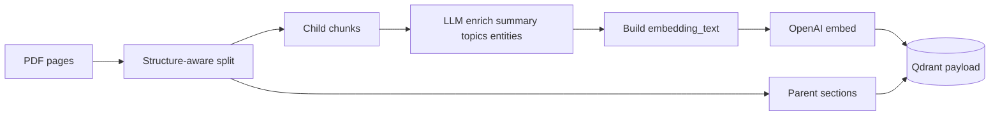

# Improve RAG Recall, Coverage, and Concept-Discovery Retrieval

## Summary

Extend the Research RAG pipeline so it answers **coverage-style** questions (risks, obligations, limitations, topic sweeps) with high **recall**, not only **fact-style** questions where query terms overlap document text. The plan layers **query intelligence** (classification, planning, multi-query fusion), **enriched indexing** (summaries, concepts, contextual embeddings), **structure-aware chunking with parent-child expansion**, and **post-retrieval verification** — while reusing existing hybrid search, RRF, and Cohere reranking.

---

## Problem Frame

**What works today:** Direct factual retrieval when the user’s words appear in the PDF (salary, notice period, named technologies). Pipeline: single rewritten query → hybrid BM25+dense → RRF (2 lists) → Cohere rerank → top `FINAL_K` (default 5) → grounded answer.

**What fails:** Concept-discovery and exhaustive-coverage queries where relevant passages use different vocabulary than the question (“company authority” vs “may terminate”, “may relocate”; “security concerns” vs “authentication”, “token expiry”).

**Root cause (systems view):** Retrieval is **single-query**, **low-K after rerank**, and **raw-chunk embeddings** without semantic enrichment or document structure. Generation cannot cite what was never retrieved.

**Goal:** Domain-agnostic improvements optimizing **recall**, **coverage**, and **faithfulness** across contracts, tech docs, research papers, policies, and wikis.

---

## Requirements

| ID | Requirement |
|----|-------------|
| R1 | Classify each user query into a retrieval strategy (at minimum: `fact_retrieval` vs `coverage_search`) before fetching chunks |
| R2 | For coverage-style queries, expand retrieval via **retrieval planning** (concept list) and **multi-query generation** (N semantic queries) |
| R3 | Merge multi-query results with **RRF across query lists** (not only dense+BM25 for one query) |
| R4 | Strategy-specific retrieval budgets: coverage mode uses higher pre-rerank K and more chunks in context than fact mode |
| R5 | At index time, enrich chunks with **summary**, **topics/concepts**, and **entities** stored in Qdrant payload |
| R6 | Embed **contextualized chunk text** (document/section context + original text) for stronger dense recall |
| R7 | Chunk using **structure signals** (headings, lists) where extractable; store section metadata |
| R8 | Support **parent-child retrieval**: retrieve child chunks, expand to parent section for LLM context and citations |
| R9 | After initial answer, run **coverage verification** that can trigger a **second retrieval pass** when gaps are detected |
| R10 | **Answer validation** checks grounding and flags under-coverage before returning response |
| R11 | **Evaluation harness** with recall@k and coverage-style golden questions; regressions visible in CI or CLI |
| R12 | Existing `/search` and `/ask` remain backward compatible; new behavior gated by settings and query type |

---

## Key Technical Decisions

| Decision | Rationale |
|----------|-----------|
| **Query classifier = small LLM JSON output** (not rules-only) | Coverage vs fact is semantic; rules miss paraphrases. Use `gpt-4o-mini` with strict schema; cache per session optional later |
| **Multi-query + planner in one LLM call for coverage mode** | Reduces latency vs 2 calls; output: `{concepts[], queries[]}` capped at N (default 8) |
| **Reuse `_reciprocal_rank_fusion` in `app/retrieval/hybrid.py`** | Already merges ranked lists; extend to accept M query lists + hybrid lists per query |
| **Coverage profile: `RETRIEVAL_K=40`, `FINAL_K=12`, `MULTI_QUERY_COUNT=8`** | Fact profile keeps current defaults (20/5). Env-configurable |
| **Enrichment at index time, not query time** | Query-time enrichment doesn’t help missed chunks; re-index required when enrichment changes |
| **Contextual embedding = `{section_context}\n\n{chunk_text}`** | Anthropic contextual retrieval pattern; store both `text` (cite) and `embedding_text` (index) in payload |
| **Topics/entities as payload + BM25 auxiliary fields** | Enables metadata filter later; concatenate topics into BM25 corpus for keyword path |
| **Parent-child via `section_id` + `parent_chunk_id`** | Child for retrieval precision; parent text assembled from children or stored section blob |
| **Coverage loop max 1 extra round** | Prevents runaway cost; configurable `COVERAGE_MAX_ROUNDS=1` |
| **Defer agentic graph/multi-hop** | Out of scope; planner+multi-query covers most “find all X” without LangGraph |

---

## High-Level Technical Design

### Current vs target retrieval path


### Indexing enrichment



---

## Scope Boundaries

### In scope

- Query classification, planning, multi-query RRF
- Index-time enrichment and contextual embeddings
- Structure-aware chunking (PDF headings/blocks via PyMuPDF)
- Parent-child expansion at retrieval
- Coverage verification + answer validation loops
- Eval dataset for recall/coverage queries
- Settings flags to disable new behavior (`MULTI_QUERY_ENABLED`, etc.)

### Deferred to follow-up work

- Persistent BM25 index (Elasticsearch / Qdrant sparse) at scale
- Cross-document corpus search (“all policies in library”)
- True multi-hop graph retrieval
- Vision/multimodal chunks
- Real-time re-enrichment without re-index
- User-facing “show all retrieved chunks” pagination in Gradio (optional small UX later)

### Outside product identity

- Training custom embedding or reranker models
- Domain-specific ontologies (legal-only clause taxonomy)

---

## Risks and Dependencies

| Risk | Mitigation |
|------|------------|
| Indexing cost 3–5× (enrichment LLM calls per chunk) | Batch enrichment; `ENRICHMENT_ENABLED` flag; process only on `/ingest/index` |
| Latency 2–4× for coverage queries | Classifier skips multi-query for `fact_retrieval`; cap query count |
| Parent expansion blows context window | Cap parent text length; summarize parent if needed |
| Classifier misroutes | Log `query_type` in response; allow `?mode=coverage` override on `/ask` |
| Re-index required | Version `index_schema_version` in payload; migration note in README |

**Dependencies:** Phase 2 complete (hybrid, rerank, `/ask`); OpenAI + Cohere keys; Qdrant payload index capacity.

---

## Phased Delivery

| Phase | Focus | Exit gate |
|-------|--------|-----------|
| **3A** | Query intelligence + multi-query RRF | Coverage questions retrieve more unique chunks than single-query baseline |
| **3B** | Index enrichment + contextual embed | Re-indexed doc improves recall on concept queries in eval set |
| **3C** | Structure + parent-child | Section questions return full clause context |
| **3D** | Coverage verify + answer validate | Second-pass retrieval fires when eval marks gap |
| **3E** | Evaluation harness | `scripts/run_eval.py` reports recall@k per question type |

---

## Implementation Units

### U1. Query classification and retrieval profiles

**Goal:** Route queries to `fact_retrieval` vs `coverage_search` (extensible enum) with per-profile K settings.

**Requirements:** R1, R4, R12

**Dependencies:** None

**Files:**
- Create `app/rag/query_classifier.py`
- Modify `app/config/settings.py`, `.env.example`
- Create `app/models/retrieval.py` (or extend `app/models/document.py`) with `QueryType`, `RetrievalProfile`

**Approach:**
- LLM returns JSON: `{"query_type": "...", "confidence": 0.9}`
- Map types to `RetrievalProfile(retrieval_k, final_k, multi_query_enabled, ...)`
- Fact: current defaults; Coverage: higher K, multi-query on

**Test scenarios:**
- Happy path: “What is the salary?” → `fact_retrieval`
- Happy path: “Identify every risk” → `coverage_search`
- Edge case: malformed classifier JSON → default `fact_retrieval` + log warning

**Verification:** `tests/test_query_classifier.py` with mocked OpenAI.

---

### U2. Retrieval planner and multi-query generator

**Goal:** Produce concept list + N retrieval queries for coverage mode.

**Requirements:** R2

**Dependencies:** U1

**Files:**
- Create `app/rag/retrieval_planner.py`
- Create `app/rag/prompts.py` (extend) — planner prompts

**Approach:**
- Single LLM call: input question (+ optional doc filename hint) → `{concepts: string[], queries: string[]}`
- Cap queries at `MULTI_QUERY_MAX` (default 8); dedupe case-insensitive
- Include original question as first query always

**Test scenarios:**
- Coverage: authority question → queries mention terminate, probation, relocation (mocked)
- Fact mode: planner not invoked

**Verification:** Unit tests with fixture JSON responses.

---

### U3. Multi-query hybrid retrieval with global RRF

**Goal:** Retrieve per query, fuse all ranked lists, dedupe by `chunk_id`.

**Requirements:** R3, R4

**Dependencies:** U2, existing `app/retrieval/hybrid.py`

**Files:**
- Create `app/retrieval/multi_query.py`
- Modify `app/retrieval/hybrid.py` — export RRF helper or move to `app/retrieval/fusion.py`

**Approach:**
```text
for q in queries:
    lists.append(search_hybrid(q, limit=retrieval_k_per_query))
merged = rrf(all_lists, limit=pre_rerank_cap)
return merged
```

- Track `retrieval_source` as `dense+keyword+mq:3` etc. for debugging

**Test scenarios:**
- Two synthetic lists with disjoint chunk_ids → both appear in merged top
- Duplicate chunk_id across lists → single entry with boosted RRF score

**Verification:** `tests/test_multi_query_retrieval.py`

---

### U4. Integrate intelligent retrieval into `/ask` pipeline

**Goal:** Wire classifier → planner → multi-query → rerank → generate.

**Requirements:** R1–R4, R12

**Dependencies:** U1, U2, U3

**Files:**
- Modify `app/rag/pipeline.py`
- Modify `app/models/document.py` — extend `AskResponse` with `query_type`, `retrieval_queries`, `concepts` (optional debug fields)

**Approach:**
- Replace single `search_hybrid(rewritten)` with `retrieve_for_question(question, profile)`
- Keep `rewrite_query` for conversational follow-ups before classification

**Test scenarios:**
- Integration: coverage question uses >1 retrieval query (mocked)
- Fact question: single-query path, `multi_query` not called

**Verification:** `tests/test_ask.py` extensions

---

### U5. Chunk enrichment models and index-time service

**Goal:** Persist summary, topics, entities per chunk at indexing.

**Requirements:** R5

**Dependencies:** None (parallel to U1–U4 but needs re-index)

**Files:**
- Extend `app/models/document.py` — `ChunkEnrichment`, extend `Chunk` payload fields
- Create `app/enrichment/chunk_enricher.py`
- Modify `app/ingestion/ingestor.py` — call enricher before upsert

**Approach:**
- Batch chunks (e.g. 10) per LLM call with JSON schema output
- Store in Qdrant payload: `summary`, `topics[]`, `entities[]`
- Append topics to BM25 token corpus in `keyword_index` rebuild

**Test scenarios:**
- Enricher returns valid schema for sample chunk
- Index pipeline stores enrichment fields in payload

**Verification:** `tests/test_chunk_enricher.py`

---

### U6. Contextual embeddings at index time

**Goal:** Embed `embedding_text` that includes section/document context; cite original `text`.

**Requirements:** R6

**Dependencies:** U5, U7 (section context — can use page-level context first if U7 delayed)

**Files:**
- Modify `app/vectorstore/qdrant_client.py` — embed `embedding_text` not raw `text`
- Modify `app/embeddings/openai_embedder.py` if batching needs length guard

**Approach:**
- Minimal v1 context: `Document: {filename}, Page {n}\nSection: {heading_or_unknown}\n\n{text}`
- Store `embedding_text` in payload for debugging

**Test scenarios:**
- Upsert uses embedding_text length ≤ model limit (truncate with log)

**Verification:** Integration test with mocked embedder recording input strings.

---

### U7. Structure-aware chunking

**Goal:** Split on headings/sections using PyMuPDF block dict; attach `section_title`, `section_level`.

**Requirements:** R7

**Dependencies:** None (replaces token-only splitter for new ingests)

**Files:**
- Create `app/chunking/structure_chunker.py`
- Modify `app/ingestion/ingestor.py` — select chunker via `CHUNKER_MODE=structure|token`

**Approach:**
- Use `page.get_text("dict")` blocks; merge blocks under headings
- Fall back to `recursive_chunker` when structure sparse (scanned pages)

**Test scenarios:**
- PDF with bold headings → chunks carry `section_title`
- Scanned page → fallback path still produces chunks

**Verification:** `tests/test_structure_chunker.py` with fixture PDF

---

### U8. Parent-child chunk graph and retrieval expansion

**Goal:** Retrieve children; expand to parent section text for LLM.

**Requirements:** R8

**Dependencies:** U7

**Files:**
- Extend chunk models: `section_id`, `parent_id`, `chunk_role` (`child`|`parent`)
- Create `app/retrieval/parent_expand.py`
- Modify `app/rag/pipeline.py` post-rerank

**Approach:**
- Parent chunk: concatenation of child texts (or section blob), not embedded separately in v1 OR embedded with lower weight
- Expansion: map child hits → unique parents; replace context blocks with parent text; citations point to page + section

**Test scenarios:**
- Two children same parent → one parent block in context
- Citation still references correct page

**Verification:** Unit test parent_expand logic

---

### U9. Coverage verification loop

**Goal:** Draft answer → detect missed concepts → optional second retrieval.

**Requirements:** R9

**Dependencies:** U4

**Files:**
- Create `app/rag/coverage_verifier.py`
- Modify `app/rag/pipeline.py`

**Approach:**
- Prompt: given question, concepts, retrieved chunk ids, draft answer → `{complete: bool, missing_concepts: []}`
- If incomplete: generate queries from missing_concepts → U3 retrieve → merge with existing → re-rerank → regenerate once

**Test scenarios:**
- Mock verifier returns gap → second retrieval invoked
- `complete: true` → no second pass

**Verification:** `tests/test_coverage_verifier.py`

---

### U10. Answer validation gate

**Goal:** Final check for unsupported claims and thin coverage.

**Requirements:** R10

**Dependencies:** U9

**Files:**
- Create `app/rag/answer_validator.py`
- Modify `app/rag/pipeline.py`

**Approach:**
- LLM JSON: `{grounded: bool, warnings: [], suggest_more_retrieval: bool}`
- If not grounded: soften answer or append disclaimer (never invent)

**Test scenarios:**
- Claims without citation markers → warning logged / user-visible note

**Verification:** Unit tests with mocked validator

---

### U11. Evaluation harness for recall and coverage

**Goal:** Measure retrieval quality separately from generation.

**Requirements:** R11

**Dependencies:** U3 (minimum for meaningful eval)

**Files:**
- Create `data/eval/recall_coverage.json`
- Create `app/eval/recall_metrics.py`
- Create `scripts/run_eval.py`
- Create `tests/eval/test_recall_metrics.py`

**Approach:**
- Golden fields: `question`, `query_type`, `expected_document_id`, `expected_pages[]` OR `must_include_substrings[]`
- Metrics: recall@k (page or chunk), unique pages in top-K, coverage query subset
- Report before/after multi-query in CLI table

**Test scenarios:**
- Metric computation on synthetic ranked lists

**Verification:** Script runs locally; document in README

---

### U12. Gradio and API observability

**Goal:** Debug coverage retrieval in UI.

**Requirements:** R12

**Dependencies:** U4

**Files:**
- Modify `gradio_ui/app.py`
- Optional: `GET /ask/debug` returning queries, concepts, chunk counts

**Approach:**
- Chat tab accordion: query type, sub-queries, chunks per pass
- Search tab: accept `?mode=coverage` to force profile

**Test scenarios:**
- Manual smoke after implementation

**Verification:** Manual checklist in README

---

## Open Questions

| Question | Resolution path |
|----------|-----------------|
| Re-index all existing PDFs on deploy? | Document manual re-upload; optional `POST /ingest/{id}/reindex` |
| Cohere rerank 40→12 cost | Accept for coverage; env toggle `RERANK_ENABLED` |
| Classifier in non-English docs | Defer; note in README |

---

## Success Criteria (from user task)

The system should materially improve on:

- “Identify every risk in this document.”
- “Find all limitations discussed.”
- “Summarize all security concerns.”
- “Explain all employee obligations.”
- “List every mention of authentication.”
- “Identify all restrictions imposed by the policy.”

**Measurable targets (eval-driven, set baselines in U11):**

- Coverage queries: **recall@20** (page-level) ≥ 2× single-query baseline on golden set
- Coverage answers: human or LLM-judge **completeness score** improves vs current `/ask`
- Fact queries: **no regression** on recall@5 or latency p95

---

## Sources and Research

- User task: general-purpose recall and coverage architecture (2026-05-30)
- Existing: `app/rag/pipeline.py`, `app/retrieval/hybrid.py`, `app/retrieval/reranker.py`, `app/chunking/recursive_chunker.py`
- Prior plan: `docs/plans/2026-05-30-001-feat-phase2-grounded-rag-plan.md`
- Patterns: Anthropic contextual retrieval; RAG-Fusion multi-query RRF
